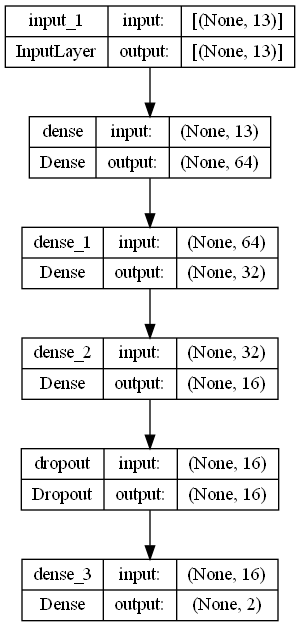
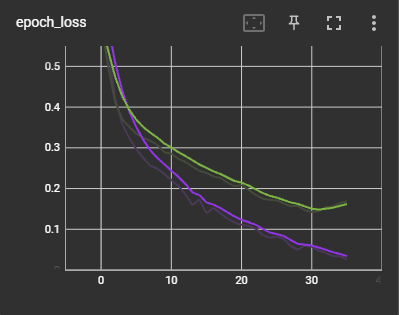
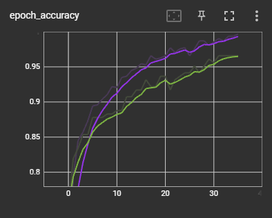
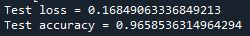

# Heart Disease Prediction using FNN

## 1. Summary
The purpose of this project is to create an accurate deep learning model to predict whether a patient has heart disease based on a series of factors. The model is trained with dataset from [Heart Disease Dataset](https://www.kaggle.com/datasets/johnsmith88/heart-disease-dataset)

## 2. IDE and Framework
This project is created using Sypder as the main IDE.  The main frameworks used in this project are Pandas, Numpy, Scikit-learn and Tensorflow Keras.

## 3. Methadology
### 3.1. Data Pipeline
The data is first loaded and checked if any preprocessing is needed. The data is then split into train-validation-test sets, with a ratio of 60:20:20.

### 3.2. Model Pipeline
As this is a classification problem, a classification feed forward neural network is created. Below is the structure of the dense neural network used in this training.

The model is trained with a batch size of 32 and 100 epochs. Early stopping is applied in the model training. The training stops at epoch 36, with a training accuracy of 99% and validation accuracy of 96%. Below is a graph showing the training process.

 

## 4. Results
When evaluating with the test data, the results are as follows.

